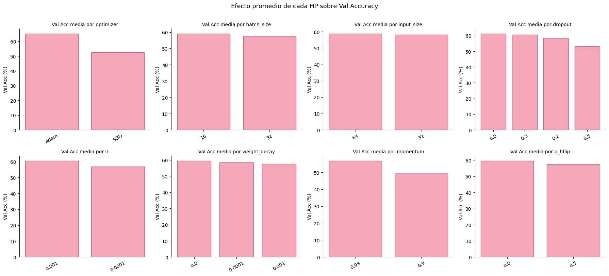
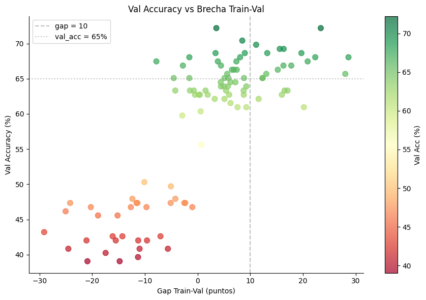
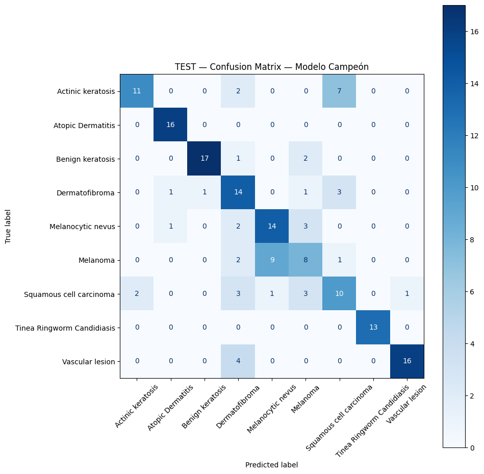

# Clasificador CNN de Lesiones Dermatológicas: Resumen

Retomo el problema de clasificación de 9 clases de lesiones dermatológicas del proyecto anterior (MLP), con el objetivo de superar el **60.95% de accuracy en test** usando CNNs.

## Flujo del Proyecto

### 0. EDA
Sin cambios respecto al proyecto anterior. 

### 1. CNN Simple: Prueba Manual (`1_CNN_Simple.ipynb`)

#### Arquitectura: AlexNet-like
Se diseñó una CNN inspirada en AlexNet (Krizhevsky et al., 2012), adaptada a imágenes pequeñas:

**Diferencias con AlexNet original**: kernels 3×3 en lugar de 11×11 (las imágenes son 64px, no 224px), LRN reemplazada por BatchNorm (más estable), escala de filtros reducida proporcionalmente.

#### Experimentos realizados (en orden incremental)

| # | Qué se cambió | 
|---|---|
| 1 | Base sin augmentations | CNN debería superar al MLP sin augmentations por su invarianza traslacional |
| 2 | + HFlip + VFlip | Las lesiones no tienen orientación canónica → flips son válidos semánticamente |
| 3 | + RandomBrightnessContrast + CLAHE | Variaciones de iluminación son frecuentes en imágenes médicas |
| 4 | + HueSaturationValue + Rotate | Diferencias de tono de piel y ángulo de captura |
| 5 | + Weight Decay 1e-4 | Regularización L2 para reducir overfitting |
| 6 | Dropout 0.5 → 0.3 | Dropout muy alto puede limitar capacidad en red no tan grande |
| 7 | Momentum 0.9 → 0.99 | En proyecto MLP, 0.99 fue consistentemente mejor |
| 8 | Batch 32 → 16 | En proyecto MLP, batch pequeño fue consistentemente mejor |

#### Transfer Learning — ResNet18 (Bonus)

Se aplicó transfer learning en 2 fases:
1. **Feature extraction**: backbone congelado, solo se entrena el clasificador FC (LR=1e-3, Adam)
2. **Fine-tuning**: se descongelan `layer3`, `layer4` + FC (LR=1e-4, SGD con momentum)

**Justificación según teoría de TL**: el dataset es de tamaño mediano y el dominio es diferente a ImageNet (lesiones de piel vs fotos naturales) , se prefiere congelar las primeras capas (que detectan bordes/texturas universales) y reentrenar las capas más profundas que codifican features de alto nivel + especificos.

---

### 2. Búsqueda de Hiperparámetros (`2_CNN_Busqueda_HP.ipynb`)

(esto lo corri en colab)

#### Espacio explorado

- `input_size`: 32, 64
- `batch_size`: 16, 32
- `lr`: 1e-3, 1e-4
- `optimizer`: SGD, Adam
- `momentum`: 0.9, 0.99
- `weight_decay`: 0, 1e-4, 1e-3
- `dropout`: 0.0, 0.2, 0.3, 0.5
- Probabilidades de augmentations: HFlip, VFlip, RBContrast, CLAHE, HSV, Rotate

**Total**: ~6144 combinaciones → se muestreó ~5% (~307 corridas) con Random Search.

### Top 10 modelos

| Run | Val Acc (%) | Train Acc (%) | Gap |
|---|---|---|---|
| rs_068 | 72.19 | 95.56 | 23.37 |
| rs_040 | 72.19 | 75.74 | 3.55 |
| rs_024 | 70.41 | 78.89 | 8.47 |
| rs_065 | 69.82 | 80.93 | 11.10 |
| rs_077 | 69.23 | 85.56 | 16.32 |
| rs_007 | 69.23 | 84.81 | 15.58 |
| rs_048 | 68.64 | 81.85 | 13.21 |
| rs_058 | 68.64 | 88.33 | 19.69 |
| rs_002 | 68.64 | 77.59 | 8.95 |
| rs_034 | 68.64 | 72.04 | 3.40 |

**Modelo elegido: rs_040** — misma val acc que rs_068 (72.19%) pero con gap de solo 3.55 vs 23.37. rs_068 está claramente overfitteando.

### Candidatos seleccionados (val_acc ≥ 65% y gap ≤ 10)

| Run | Val Acc (%) | Gap | Optimizer | LR | Batch | Input | Dropout | Momentum |
|---|---|---|---|---|---|---|---|---|
| rs_040 | 72.19 | 3.55 | Adam | 1e-4 | 16 | 64 | 0.3 | — |
| rs_024 | 70.41 | 8.47 | Adam | 1e-4 | 16 | 64 | 0.2 | — |
| rs_002 | 68.64 | 8.95 | Adam | 1e-4 | 32 | 32 | 0.0 | — |
| rs_034 | 68.64 | 3.40 | SGD | 1e-3 | 16 | 32 | 0.0 | 0.99 |
| rs_001 | 68.05 | -1.57 | Adam | 1e-3 | 32 | 32 | 0.2 | — |
| rs_076 | 68.05 | 8.06 | Adam | 1e-4 | 16 | 64 | 0.2 | — |
| rs_027 | 67.46 | 3.84 | Adam | 1e-3 | 16 | 32 | 0.5 | — |
| rs_044 | 67.46 | 7.36 | Adam | 1e-3 | 16 | 64 | 0.0 | — |
| rs_061 | 67.46 | -7.83 | Adam | 1e-4 | 16 | 64 | 0.5 | — |
| rs_033 | 66.86 | -2.79 | Adam | 1e-4 | 16 | 64 | 0.5 | — |
| rs_036 | 66.86 | 4.43 | Adam | 1e-4 | 16 | 32 | 0.3 | — |
| rs_095 | 66.27 | 6.51 | SGD | 1e-3 | 32 | 64 | 0.2 | 0.99 |
| rs_023 | 66.27 | 6.88 | Adam | 1e-4 | 32 | 32 | 0.5 | — |
| rs_094 | 66.27 | 7.43 | Adam | 1e-3 | 16 | 64 | 0.3 | — |
| rs_032 | 65.68 | 5.62 | SGD | 1e-3 | 16 | 32 | 0.2 | 0.90 |
| rs_085 | 65.09 | -4.53 | Adam | 1e-3 | 16 | 32 | 0.5 | — |
| rs_083 | 65.09 | 5.10 | Adam | 1e-3 | 32 | 32 | 0.3 | — |
| rs_039 | 65.09 | 5.84 | Adam | 1e-3 | 16 | 64 | 0.2 | — |
| rs_035 | 65.09 | -1.57 | SGD | 1e-4 | 16 | 64 | 0.0 | 0.99 |
| rs_021 | 65.09 | 8.80 | SGD | 1e-3 | 16 | 64 | 0.0 | 0.99 |

## Conclusiones de la búsqueda

1. **¿Qué optimizer funcionó mejor, SGD o Adam?**  
   Adam ganó por ~12 puntos de diferencia promedio. Es la conclusión más clara de toda la búsqueda.

2. **¿Qué batch size fue mejor, 16 o 32?**  
   Batch 16 fue levemente mejor, consistente con lo visto en el proyecto MLP.

3. **¿Qué input size fue mejor, 32 o 64?**  
   Para CNN (a diferencia del MLP) se esperaba que 64 ganara porque los filtros  
   convolucionales se benefician de mayor resolución espacial. Resultado: 64 y 32 fueron prácticamente iguales, sorprendentemente.

4. **¿Qué augmentations aportaron más?**  
   HFlip p=0.0 fue levemente mejor que p=0.5, sugiriendo que las augmentations no aportaron significativamente en la búsqueda con pocas épocas (30). Se necesita más entrenamiento para verlo.

5. **¿Qué dropout fue más efectivo?**  
   Dropout 0.0 y 0.3 fueron los mejores. Dropout 0.5 fue claramente el peor, apagaba demasiadas neuronas.

6. **Mejor modelo encontrado**: Run `rs_040` con val acc `72.18%`.

## 4. Refinamiento Manual de Candidatos Ganadores

#### Configuración usada (HPs del mejor modelo, con el que hice el test): 

| HP | Valor |
|---|---|
| Optimizer | Adam |
| LR | 1e-4 |
| Batch size | 16 |
| Input size | 64×64 |
| Dropout | 0.3 |
| Weight decay | 0 |
| VFlip | 0.5 |
| RandomBrightnessContrast | 0.5 |
| CLAHE | 0.3 |
| Rotate | 0.4 |
| Early stopping patience | 7 |

#### Resultado

| Métrica | Valor |
|---|---|
| Train Acc (último epoch) | 79.63% |
| **Val Acc (mejor)** | **67.46%** |
| Epochs | 23 (early stopping) |

### BONUS — Transfer Learning con ResNet18 
 
**Estrategia**: dataset mediano + dominio diferente a ImageNet (lesiones de piel vs fotos naturales) → congelar backbone, entrenar solo el clasificador (fase 1), después fine-tuning de las últimas capas (fase 2).
 
**Input size**: 224×224 (resolución nativa de ResNet18).
 
**Augmentations**: HFlip, VFlip, RandomBrightnessContrast, CLAHE, HueSaturationValue, Rotate.
 
#### Fase 1 — Feature Extraction
Backbone congelado. Solo se entrena el clasificador FC (Linear(512→256) + ReLU + Dropout(0.4) + Linear(256→9)).
 
| Métrica | Valor |
|---|---|
| Train Acc (mejor epoch) | 72.22% |
| **Val Acc (mejor)** | **80.47%** |
| Epochs | 20 |
| Optimizer | Adam lr=1e-3 |
| Parámetros entrenables | 133,641 |
 
#### Fase 2 — Fine-tuning
Se descongelan layer3, layer4 y FC. LR muy bajo para no destruir pesos preentrenados.
 
| Métrica | Valor |
|---|---|
| Train Acc (último epoch) | 80.19% |
| **Val Acc (mejor)** | **80.47%** |
| Epochs | 7 (early stopping) |
| Optimizer | SGD lr=1e-4, momentum=0.9 |
| Parámetros entrenables | 10,627,081 |
 
**Conclusión**: el fine-tuning no mejoró respecto a la fase 1. El backbone preentrenado ya capturó suficientes features útiles con solo entrenar el clasificador.
 
---

## 5. Test (Evaluación Final)
Se procedió con la evaluación definitiva del modelo campeón  utilizando el **Test Set**.
 
| Métrica | Valor |
|---|---|
| **Test Accuracy** | **70.41%** |
| **Test Loss** | **0.7408** |
 
### Reporte por clase
 
| Clase | Precision | Recall | F1 | Support |
|---|---|---|---|---|
| Actinic keratosis | 0.85 | 0.55 | 0.67 | 20 |
| Atopic Dermatitis | 0.89 | 1.00 | 0.94 | 16 |
| Benign keratosis | 0.94 | 0.85 | 0.89 | 20 |
| Dermatofibroma | 0.50 | 0.70 | 0.58 | 20 |
| Melanocytic nevus | 0.58 | 0.70 | 0.64 | 20 |
| Melanoma | 0.47 | 0.40 | 0.43 | 20 |
| Squamous cell carcinoma | 0.48 | 0.50 | 0.49 | 20 |
| Tinea Ringworm Candidiasis | 1.00 | 1.00 | 1.00 | 13 |
| Vascular lesion | 0.94 | 0.80 | 0.86 | 20 |
| **accuracy** | | | **0.70** | **169** |
| macro avg | 0.74 | 0.72 | 0.72 | 169 |
| weighted avg | 0.72 | 0.70 | 0.71 | 169 |
 
### Análisis de la matriz de confusión

 
**Clases que funcionaron muy bien:**
- Tinea Ringworm Candidiasis — 100% en precision, recall y f1. Perfecta.
- Atopic Dermatitis — 100% recall, el modelo no se perdió ningún caso.
- Benign keratosis y Vascular lesion — muy sólidas (f1 > 0.85).
**Clases problemáticas:**
- Melanoma — la peor (f1=0.43). Preocupante porque es la más crítica clínicamente.
- Squamous cell carcinoma — f1=0.49, confusión con Actinic keratosis (su precursora, igual que en el MLP). Tiene sentido clínico: son fases de la misma enfermedad.
- Dermatofibroma — f1=0.58.
---
 

